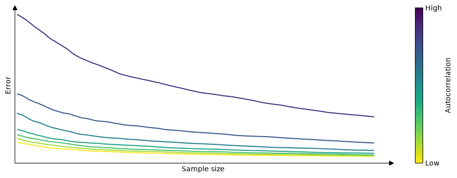
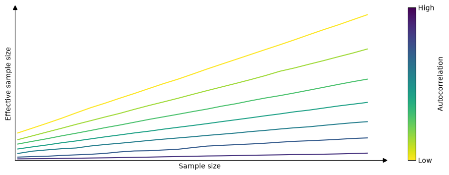

# MCMC Diagnostics {#sec-mcmc-diagnostics}

```{python}
#| echo: false
#| warning: false
import warnings
warnings.filterwarnings("ignore")
import arviz as az
import matplotlib.pyplot as plt
az.style.use("arviz-variat")
plt.rcParams["figure.dpi"] = 75
```

```{r}
#| echo: false
#| warning: false
library(bayesplot)
library(posterior)
```

While MCMC methods can be successfully used to solve a huge variety of Bayesian models, they have some trade-offs. Most notably, finite MCMC chains are not guaranteed to converge to the true posterior distribution. Thus, a key step is to check whether we have a valid sample, otherwise, any analysis from it will be totally flawed.

There are several tests we can perform, some are visual and some are numerical. These tests are designed to spot problems with our samples, but they are unable to prove we have the correct distribution; they can only provide evidence that the sample seems reasonable.

In this chapter, we will cover the following topics:

* $\hat R$
* Effective Sample Size
* Monte Carlo Standard Error
* Minimum sample size for reliable MCSE (Pareto-$\hat k$ diagnostic)

## From the MCMC theory to practical diagnostics

The theory describes certain behaviors of MCMCs methods, many diagnoses are based on evaluating whether the theoretical results are empirically verified. For example, MCMC theory says that:

* The initial value is irrelevant, we must always arrive at the same result
* The samples are not really independent, but the value of a point only depends on the previous point, there are no long-range correlations.
* If we analyze a sample as a sequence we should not be able to find any patterns.
    * For example, for a sufficiently long sample, the first portion must be indistinguishable from the last (and so should any other combination of regions).
* For a given model, every time we sample from the posterior distribution, the generated samples will be different from the others, but for our purposes, they should be practically indistinguishable from each other.

We are going to see that many diagnostics need multiple chains. Each chain is an independent MCMC run. The logic is that by comparing independent runs we can more easily spot issues than running a single instance. This multiple-chain approach also takes advantage of modern hardware. If you have a CPU with 4 cores you can get 4 independent chains in essentially the same time that one single chain.

To keep the focus on the diagnostics and not on any particular Bayesian model. We are going to first create 3 synthetic samples, we will use them to emulate samples from a posterior distribution.

* `good_sample`: A random sample from a `Gamma(2, 5)`. This is an example of a good sample because we are generating independent and identically distributed (iid) draws. This is the ideal scenario.
* `bad_sample_0`: We sorted good_sample, split it into four chains, and then added a small Gaussian error. This is a representation of a bad sample because values are not independent (we sorted the values!) and they do not come from the same distribution. This represents a scenario where the sampler has clearly very poor mixing.
* `bad_sample_1`: we start from `good_chains`, and turn into a poor sample by randomly introducing portions where consecutive samples are highly correlated to each other. This represents a common scenario, a sampler can resolve a region of the parameter space very well, but get stuck into one or more regions.

::: {.panel-tabset group="language"}
## Python
```{python}
#| code-summary: "Show the code for more details"
sample = az.convert_to_datatree("../../models/prerun/sample.nc")
```
## R
```{r}
sample <- readRDS("../../models/prerun/sample.rds")
```
:::


## $\hat R$ (R-hat)

$\hat R$ is a numerical diagnostic that answers the question Did the chains mix properly?  The central idea is to compare the variance between chains with the variance within each chain. The version implemented in `ArviZ` and in `posterior` is described in @vehtari_2021, which does several other things under the hood, but the main idea is the same.


$\hat{R}$ is a convergence diagnostic that asks: *have the chains converged to the same distribution?* The central idea is to compare the variance between chains with the variance within each chain. If the chains have converged, these two estimates should agree, and $\hat R \to 1$. If one or more chains are in different regions of parameter space, with respect to the others, the between-chain variance will be inflated relative to the within-chain variance, and $\hat R > 1$.

Formally, if we have $M$ chains each of length $N$, we compute the within-chain variance $W$ (the average of the per-chain variances) and an estimate of the posterior variance $\widehat{\mathrm{var}}^+$ that combines $W$ with the between-chain variance $B$. $\hat R$ is then the ratio

$$
\hat R = \sqrt{\frac{\widehat{\mathrm{var}}^+}{W}}.
$$

The version implemented in `ArviZ` and in `posterior` follows @vehtari_2021, and improves on the original @gelman_rubin_1992 statistic in three ways:

* It *splits* each chain in half before comparing them (so it can catch non-stationarity within a single chain, not just disagreement across chains)
* It *rank-normalizes* the draws before computing $\hat R$ (so it isn't thrown off by heavy-tailed posteriors, where ordinary variance estimates are unstable),
* It computes a $\hat R$ on the *folded* (absolute deviation from the median) draws to catch differences in scale, not just location, between chains.

The final reported $\hat R$ is the maximum of the rank-normalized and folded $\hat R$ values. Because of these refinements, the recommended convergence threshold is stricter than it used to be: $\hat R < 1.01$, rather than the older rule of thumb of $1.1$.

We can compute $\hat R$ with:

::: {.panel-tabset group="language"}
## Python
```{python}
az.rhat(sample)
```
## R
```{r}
summarise_draws(sample, rhat)
```
:::

Rhat can be computed with:

::: {.panel-tabset group="language"}
## Python
```{python}
az.summary(sample, kind="diagnostics")
```
## R
```{r}
summarise_draws(sample, rhat)
```
:::

It's important to keep in mind that $\hat R$ close to 1 is a *necessary but not sufficient* condition for convergence: it can still be fooled, for example if all chains happen to get stuck in the same region of a multimodal posterior, or fail to explore the tails in the same way. A low $\hat R$ tells you the chains agree with each other, but it says nothing about whether they've explored *enough* of the posterior to give you reliable estimates. That's the question the effective sample size (ESS) answers next.


## Nested Rhat

It is becoming more common to run many short chains rather than just a few longer chains. This allows for potentially large speed ups if running parallel. @Margossian2024 has developed an updated R-hat diagnostic for use in this paradigm, called nested R-hat. The key difference is that chains are grouped into superchains. All chains within a superchain are initialized at the same point. Nested R-hat then quantifies the ratio between within super-chain and between superchain variances.

::: {.panel-tabset group="language"}
## Python
```{python}
#| eval: false
superchain_ids = [i for i in range(10) for j in range(5)]

az.rhat_nested(sample, superchain_ids = superchain_ids)
```
## R
```{r}
many_short_chains <- readRDS("../../models/prerun/many_short_chains.rds")

summarise_draws(
    many_short_chains,
    rhat,
    nested_rhat = ~ rhat_nested(.x, superchain_ids = attr(many_short_chains, "superchain_ids"))
)
```
:::


## Effective Sample Size (ESS)

$\hat R$ tells us whether the chains agree with each other, but it says nothing about how much *information* those chains actually contain. That's the question the **effective sample size** (ESS) answers.

Because MCMC draws are autocorrelated, a sample of size $N$ typically carries less information than $N$ independent draws would. Intuitively, each new draw contributes less than a full "unit" of information when it's highly correlated with the previous ones, and close to a full unit when it's nearly independent. The **effective sample size** (ESS) diagnostics formalizes this by adding up how much independent information the draws actually carry. We can interpret it as the size of an iid sample that would give us the same precision as our (autocorrelated) MCMC sample.

The following figure illustrates this. It shows the error incurred when estimating the mean from samples of increasing size, under varying degrees of autocorrelation, averaged over 1000 repetitions. We can see tha the error shrinks as the sample size grows, but how fast it shrinks depends on the autocorrelation: the higher the autocorrelation, the more draws we need to reach a given precision.

{fig-alt="autocorrelation error"}

Formally, for a stationary chain with autocorrelation $\rho_t$ at lag $t$, the effective sample size of $N$ draws is

$$
\mathrm{ESS} = \frac{N}{1 + 2\sum_{t=1}^{\infty} \rho_t}.
$$

When $\rho_t = 0$ for all $t$ (independent draws), $\mathrm{ESS} = N$. As autocorrelation increases, the denominator grows and $\mathrm{ESS}$ shrinks, sometimes far below $N$.

In practice we don't know the $\rho_t$'s and must estimate them from the draws themselves, which is where @vehtari_2021 comes in. As with $\hat R$, the version implemented in `ArviZ` and `posterior` improves on the classical estimator by combining information across chains (via split chains) and by rank-normalizing the draws before estimating autocorrelations, which makes the estimate more robust for posteriors that are far from Gaussian.

The following figure illustrates the resulting relationship between raw sample size and ESS: ESS increases with sample size, but the slope is steeper for lower autocorrelation, consistent with the intuition developed above.

{fig-alt="effective sample size vs sample size"}


ESS can be computed with:

::: {.panel-tabset group="language"}
## Python
```{python}
az.summary(sample, kind="diagnostics")
```
## R
```{r}
summarise_draws(sample, ess_bulk, ess_tail)
```
:::

We have shown two values for ess, `ess_bulk` and `ess_tail`. This is because different regions of the posterior are not necessarily sampled with the same efficiency, so a single ESS number would be misleading.

`ess_bulk` measures the effective sample size for the central part of the distribution. It is computed from rank-normalized draws, which makes it sensitive to the overall shape of the posterior rather than just its location. If you are interested in estimates like the mean or median, `ess_bulk` is the number to watch.

`ess_tail` measures the effective sample size for the tails of the distribution. It is defined as the minimum of the effective sample sizes for 5% and 95% quantiles. Taking the minimum of the two is a conservative choice: it reports the ESS of whichever tail is less well sampled. If you are computing interval estimates such as a 95% HDI or ETI, `ess_tail` is the relevant quantity.

Intuitively, when sampling a unimodal distribution like a Gaussian, the sampler tends to visit the center more often than the tails, so it is natural to expect `ess_bulk` $\geq$ `ess_tail`. But this is not guaranteed: for some models the tails may actually be better explored than the bulk. It is even possible for ESS to exceed the raw sample size $N$, which can happen when draws are slightly anti-correlated, a sign that the sampler is deliberately over-dispersed, as in some well-tuned HMC configurations. This is not a cause for concern; it simply means the heuristic of "ESS as equivalent iid sample size" has its limits.


We can also compute ESS with standalone functions:

::: {.panel-tabset group="language"}
## Python
```{python}
# Other methods are "tail", "quantile", etc. Default is "bulk"
az.ess(sample, method="bulk")
```
## R
```{r}
# Other functions are ess_tail, ess_quantile, etc
summarise_draws(sample, ess_bulk)
```
:::

A practical rule of thumb is to require an ESS of at least 100 per chain. With 4 chains, that means a minimum of 400 effective samples for both `ess_bulk` and `ess_tail` before trusting your estimates.

::: {.callout-note}
ESS can also serve as a measure of sampler *efficiency*, not just a convergence check. A natural metric is ESS per draw (ESS/$N$): a value close to 1 means the sampler is producing nearly independent draws, while a value close to 0 signals high autocorrelation and poor efficiency. Other common variants are ESS per second and ESS per likelihood evaluation, which are useful when comparing samplers with different computational costs per step.
:::


<!-- TODO: These function do not exist in bayesplot (AFAIK), we can remove this discussion if you want -->
ArviZ offers several functions linked to the ESS. For example, if we want to evaluate the performance of the sampler for several regions at the same time we can use `az.plot_ess`.


::: {.panel-tabset group="language"}
## Python
```{python}
az.plot_ess(
    sample,
    col_wrap=1,
)
```
## R
```{r}
# Not available in bayesplot
```
:::


A simple way to increase the ESS is to increase the number of samples, but it could be the case that the ESS grows very slowly with the number of samples, so even if we increased the number of samples 10 times we could still be very far from our target value. One way to estimate "how many more samples do we need" is to use `az.plot_ess_evolution(.)`. This graph shows us how the ESS changed with each iteration, which allows us to make predictions.

From the next figure we can see that the ESS grows linearly with the number of samples for `good_sample`, and it does not grow at all for `bad_sample_0`. In the latter case, this is an indication that there is virtually no hope of improving the ESS simply by increasing the number of draws.

::: {.panel-tabset group="language"}
## Python
```{python}
#| fig-cap: "ESS evolution plot for `good_sample` and `bad_sample_0`."
az.plot_ess_evolution(
    sample,
    var_names=["good_sample", "bad_sample_0"],
    col_wrap=1,
);
```
## R
```{r}
# Not available in bayesplot
```
:::

### Monte Carlo Standard Error (MCSE)

An advantage of the ESS is that it is scale-free: it does not matter whether a parameter varies between 0.1 and 0.2 or between 2000 and 0. An ESS of 400 has the same meaning in both cases. This makes it easy to quickly identify the most problematic parameters in a model with many variables. However, when reporting results it is not very informative to know whether the ESS was 1372 or 1501. What we really want to know is the magnitude of the error we are making when using MCMC samples to approximate a posterior quantity of interest. That is what the **Monte Carlo standard error** (MCSE) provides.

The MCSE is essentially the standard error of a posterior estimate, like the mean, accounting for the autocorrelation in the draws. In fact, it is closely related to the ESS: $\text{MCSE} = \hat{\sigma} / \sqrt{\text{ESS}}$, where $\hat\sigma$ is the estimated posterior standard deviation. The MCSE should be small relative to the precision we want to report. For example, if the MCSE for a parameter mean is 0.1, then reporting that mean as 3.15 is misleading, the true value could plausibly be anywhere from about 3.0 to 3.3.

```{python}
#| echo: false
import arviz as az
sample = az.convert_to_datatree("../../models/prerun/sample.nc")
```

::: {.panel-tabset group="language"}
## Python
```{python}
az.mcse(sample)
```
## R
```{r}
summarise_draws(sample, mcse_mean)
```
:::


For a discussion of how many digits to report, check [this guide using R](https://avehtari.github.io/Bayesian-Workflow/digits/digits.html). [this guide using Python](https://arviz-devs.github.io/bayesian-workflow/digits/digits.html).


## Pareto-$\hat k$ diagnostic


$\hat R$, Bulk-ESS, and Tail-ESS are designed to be valid even for distributions with infinite variance [@vehtari_2021], but MCSE and Basic-ESS assume finite variance. Thus if we sample from a distribution with infinite variance the MCSE will be overoptimistic. Even when variance is finite, the MCSE estimate can be unreliable if the tails are thick enough that higher moments are infinite, since in that case the empirical variance estimate itself is noisy and convergence is slow.

The Pareto-$\hat k$ diagnostic was originally introduced in the context of Pareto smoothed importance sampling (PSIS) [@vehtari_2022], where it was used to assess the reliability of importance sampling estimates. The key insight is that when estimating a mean from a finite sample, the reliability of the estimate depends on the tail behavior of the distribution: if the tails are too heavy, the variance, or even the mean itself, may not exist, and no amount of additional sampling will produce a reliable estimate. The Pareto-$\hat k$ statistic quantifies this by fitting a generalized Pareto distribution to the upper tail of the draws and using the estimated shape parameter $\hat k$ as a diagnostic. Although it was developed for importance sampling, it turns out to be useful more broadly, including for diagnosing MCMC samples [@vehtari_2024]. The Pareto-$\hat k$ estimate can be turned into a minimum sample size required to trust the MCSE:

$$
\text{min\_ss} = 10^{1 / (1 - \max(0, \hat k))}
$$

If the actual sample size exceeds `min_ss`, Pareto-smoothed estimates can be considered reliable. If not, collecting more samples may help, but if $\hat k \geq 1$, the mean does not exist and no amount of additional sampling will fix the problem.

::: {.panel-tabset group="language"}
## Python
```{python}
az.summary(sample, kind="mc_diagnostics")
```
## R
```{r}
summarise_draws(sample, mcse_mean, ess_mean, min_ss = pareto_min_ss)
```
:::

For `good_sample`, `bad_sample_0`, and `bad_sample_1`, the `min_ss` is around 10, meaning we need at least 10 samples to trust the MCSE. This is a low bar that all three variables easily clear, because all of them have finite variance and finite mean — even when sampling is poor, the underlying distribution is well-behaved.

To see the diagnostic do more interesting work, we switch to an example with genuinely thick-tailed distributions. We generate MCMC draws using an AR(1) process with marginal $\text{Normal}(0, 1)$ distribution (`xn`), then transform those draws to obtain variables with marginal $t_\nu$ distributions for $\nu \in \{3, 2.5, 2, 1.5, 1\}$. The $t$ distribution has finite variance only when $\nu > 2$, and finite mean only when $\nu > 1$. The $t_1$ distribution is the Cauchy, which has neither.

::: {.panel-tabset group="language"}
## Python
```{python}
drt = az.convert_to_datatree("../../models/prerun/drt.nc")
```
## R
```{r}
drt <- readRDS("../../models/prerun/drt.rds")
```
:::

::: {.panel-tabset group="language"}
## Python
```{python}
az.summary(drt, kind="mc_diagnostics")
```
## R
```{r}
summarise_draws(drt, mcse_mean, ess_mean, min_ss = pareto_min_ss)
```
:::

As expected, `min_ss` is around 10 for `xn` (finite variance, well-behaved tails) and grows with tail thickness: moderate for `xt3` and `xt2_5` (both have finite variance since $\nu > 2$), and infinite for `xt2`, `xt1_5`, and `xt1`, where variance does not exist ($\nu \leq 2$). For `xt1` (Cauchy), the mean itself does not exist either, so no finite sample can give us a reliable estimate of it.

The practical takeaway is that if you are not estimating means of thick-tailed quantities and there are no sampling pathologies caused by heavy tails, you do not need to check Pareto-$\hat k$ for every parameter. However, Pareto smoothing can substantially reduce Monte Carlo error for mean and extreme quantile estimates when applicable.


## What to do when diagnostics are bad?

**Get more samples.** Increasing the number of draws (or tuning steps) can help, but usually only when problems are minor (for instance when are close to the rule of thumb thresholds). If $\hat R$ is well above 1.01 or the ESS is extremely low, more samples are unlikely to save you.

**Increase the target acceptance rate.** Divergences in HMC/NUTS samplers can often be reduced by asking the sampler to take smaller, more careful steps — for example via `target_accept` in PyMC or `adapt_delta` in Stan. If you need to push this above ~0.98 or so and divergences persist, smaller steps alone won't fix the underlying problem.

**Reparameterize the model.** Some models can be expressed in mathematically equivalent ways where some parameterizations are much more efficient to sample than others. The classic example is the centered vs. non-centered parameterization in hierarchical models.

**Reconsider the model — the folk theorem.** The _folk theorem of statistical computing_ [@gelman_2008] states that when you have computational problems, often there is also a problem with your model. Bad sampling is a symptom worth taking seriously: before trying to fix the sampler, ask whether the model itself is well-specified. Sometimes bad sampling is a symptom of a coding mistake or very badly specified priors.

**Read the warnings.** Modern PPLs provide targeted warning messages and diagnostics when they detect sampling problems. These messages often point directly at the issue and are worth reading carefully before trying anything else.

<!-- Not sure if still make sense to say this, we may want to keep for those coming from old PPLs/custom MH samplers -->
**Don't do burn-in manually.** Modern PPLs like Stan, PyMC, NumPyro, and Turing automatically discard warmup samples used to tune the sampler's hyperparameters. Manual burn-in is generally unnecessary and a sign you may be using an older workflow.
